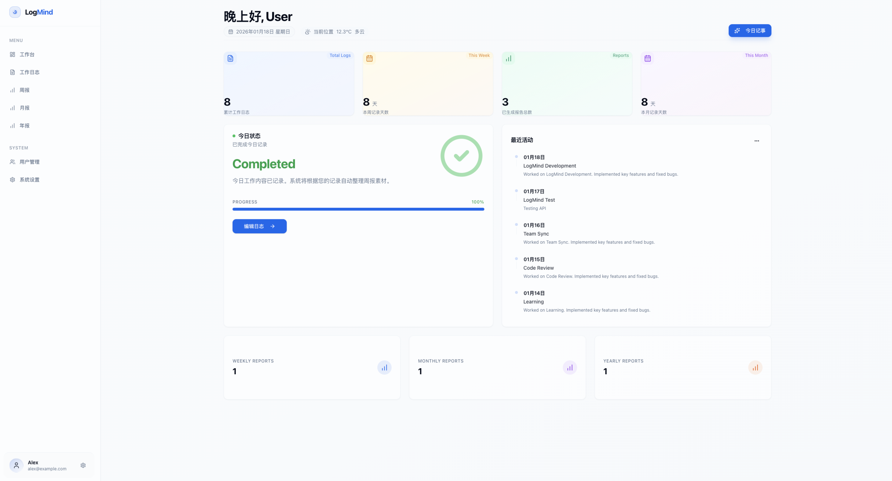

# LogMind

[English](README.md) | [中文](README_zh.md)

Log your work. Let Logmind think.



LogMind is an intelligent work logging and reporting system that helps you track daily tasks and automatically generates weekly, monthly, and yearly reports using AI.

## Features

- **📊 Smart Dashboard**: Real-time overview of work progress, recent activities, and report statistics with visual charts.
- **📝 Structured Daily Logs**: Record daily work items with priority, progress tracking, and plans for tomorrow.
- **🤖 AI-Powered Reports**: Automatically generate professional Weekly/Monthly/Yearly reports using customizable AI prompts (OpenAI/Azure/Custom).
- **🔍 Fast Search**: Instant local search for logs and reports.
- **⚙️ Flexible Configuration**: Configure AI Providers and customize Prompt templates to fit your workflow.
- **🎨 Modern UI**: Responsive design built with Tailwind CSS and Shadcn/ui, supporting Dark Mode.
- **🔐 Secure & Private**: Data stored in your own database (PostgreSQL/SQLite).

## Getting Started

### Prerequisites

- Node.js 18+
- PostgreSQL (or SQLite for local dev)

### Local Development

1.  **Clone the repository**
    ```bash
    git clone https://github.com/your-username/LogMind.git
    cd LogMind/logmind
    ```

2.  **Install Dependencies**
    ```bash
    npm install
    ```

3.  **Setup Database**
    Update `.env` with your database URL (default is SQLite for quick start, but PostgreSQL is recommended for production).
    ```bash
    # Create .env file
    cp .env.example .env
    
    # Run migrations
    npx prisma generate
    npx prisma migrate dev --name init
    
    # Seed initial data (optional)
    npx tsx prisma/seed.ts
    ```

4.  **Run Development Server**
    ```bash
    npm run dev
    ```

5.  **Open Browser**
    Go to [http://localhost:3000](http://localhost:3000)

### Docker Deployment (Recommended)

1.  **Build and Run**
    ```bash
    docker-compose up -d --build
    ```

2.  **Access Application**
    The app will be available at [http://localhost:3000](http://localhost:3000).
    The default database is PostgreSQL running in a separate container.

## AI Configuration

To use AI reporting features:
1.  Go to **Settings** > **AI Connection**.
2.  Enter your API Key (OpenAI, Azure, or Custom).
3.  Go to **Settings** > **Prompt Templates** to customize how your reports are generated.

## Tech Stack

- **Framework**: Next.js 15 (App Router)
- **Database**: PostgreSQL / SQLite (via Prisma ORM)
- **UI**: Tailwind CSS + Shadcn/ui
- **Auth**: NextAuth.js (v5)
- **Language**: TypeScript
- **Deployment**: Docker support included

## License

MIT
